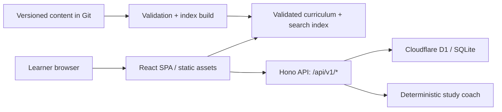

# Architecture — Interview Architect

## 1. Product boundary

Interview Architect is a modular-monolith learning product for backend and system-design interview practice. It is deliberately **not** a microservices platform: Redis and Kafka are curriculum subjects, not infrastructure that the product needs to operate.

The first release provides a polished end-to-end path:

1. Browse a curated curriculum.
2. Search and filter original interview questions.
3. Open a detailed question, use hints and an answer rubric, and complete a timed self-review.
4. Persist progress anonymously.
5. Receive the next best question from an explainable, no-cost study coach.

## 2. Architectural decisions

| Decision | Choice | Reason |
| --- | --- | --- |
| Application shape | Modular monolith | Small surface area, low operational cost, and clear module boundaries. |
| Frontend | React + TypeScript + Vite | A fast, responsive single-page application with a well-tested component model. |
| API | Hono + TypeScript on Cloudflare Workers | Lightweight, same-origin `/api` routes, and no always-on server cost. |
| Persistence | Cloudflare D1 / SQLite | Relational learner progress with migrations and a free-tier deployment option. |
| Content source | Versioned JSON records in Git | Reviewable, reproducible content without a paid CMS. |
| Search | Client-side index | Instant catalog search without a database read per query. |
| Coaching | Deterministic domain algorithm | Useful on day one, explainable, testable, and independent of paid model APIs. |
| Identity for MVP | Anonymous, cookie-backed session | Removes sign-up friction; OAuth can be added later. |

## 3. System overview



The static catalog contains modules, topics, and questions. The API only handles personal state: anonymous sessions, attempts, bookmarks, mastery, review queues, and coach recommendations. This keeps the public, read-heavy learning experience fast and inexpensive.

## 4. Repository layout

```text
apps/
  web/                  React UI, routes, local search, practice experience
  api/                  Hono handlers and Cloudflare bindings
packages/
  content/              Versioned curriculum/question sources and validation
  domain/               Shared types, mastery calculations, coach algorithm
infra/
  migrations/           D1 schema migrations
  wrangler.jsonc        Cloudflare Worker + Static Assets configuration
docs/                   Product, architecture, deployment, QA documentation
tests/e2e/              Playwright learner-flow smoke test
```

`packages/domain` must not import React, Hono, or D1. Its logic is therefore simple to test, and the coaching implementation can evolve without rewriting UI or HTTP code.

## 5. Domain model

### Curriculum catalog

```text
track → module → topic → learning objective → question
question ↔ tags
```

Each question is an original editorial record with:

- title, prompt, topic, difficulty, format, and timebox
- interviewer context and constraints
- expected answer outline, progressive hints, and follow-ups
- a scored rubric and common pitfalls
- original sources/references and content version

### Learner state

```text
anonymous_users
sessions
practice_attempts
attempt_rubric_scores
bookmarks
topic_mastery
```

The key indexes are `(user_id, completed_at)`, `(user_id, next_review_at)`, `(question_id, question_version)`, `(token_hash)`, `(expires_at)`, and a partial unique index that permits only one in-progress attempt per learner/question.

## 6. API surface for the MVP

| Method | Path | Purpose |
| --- | --- | --- |
| `GET` | `/api/v1/health` | Health check for local/dev deployment verification. |
| `POST` | `/api/v1/session/anonymous` | Create or refresh an anonymous browser session. |
| `GET` | `/api/v1/me` | Return the current anonymous learner profile. |
| `DELETE` | `/api/v1/me` | Erase the anonymous learner record and clear the session cookie. |
| `GET` | `/api/v1/progress` | Return module/topic progress and review metrics. |
| `POST` | `/api/v1/attempts` | Start a timed question attempt, or return the existing in-progress attempt for a safe retry. |
| `PATCH` | `/api/v1/attempts/:id` | Complete an attempt and store self-review scores. |
| `GET` | `/api/v1/bookmarks` | Return the learner's saved question IDs. |
| `PUT` | `/api/v1/bookmarks/:questionId` | Add or remove a saved question. |
| `GET` | `/api/v1/review-queue` | Return review-due questions. |
| `POST` | `/api/v1/coach/next` | Return the next best question and the reason it was selected. |

Catalog content is loaded from the static content package in the first release. This avoids duplicating source material into a database while preserving a clean repository interface for a future content API.

## 7. Deterministic study coach

The MVP coach is not an LLM. It scores eligible questions from the learner's selected role, available time, prerequisites, completion state, confidence, mastery, and recency.

It returns:

- one recommended question
- an explainable reason for the selection
- target time and expected answer checklist
- a progressively revealed hint sequence
- a recommended next topic after completion

Later, an optional AI-provider adapter can enrich the coaching experience. It will require an explicit user-provided provider key and will not store that key in the service.

## 8. Security and privacy baseline

- Validate every API body and parameter with shared schemas.
- Use parameterized D1 queries only.
- Store opaque, hashed session identifiers in `HttpOnly`, `Secure`, `SameSite=Lax` cookies.
- Enforce origin checks for write operations.
- Keep answer text local by default; only completion, self-assessment, bookmarks, and mastery signals are synced.
- Provide `DELETE /api/v1/me` for anonymous learner-data deletion; the response expires the cookie and asks supporting browsers to clear local storage.
- Never log sessions, cookies, answer drafts, provider keys, or secrets.
- Escape/sanitize any rendered Markdown; curriculum records cannot include raw HTML.
- Apply a restrictive static-asset CSP, deny framing, and restrict browser permissions through Cloudflare Workers Static Assets headers.
- Put deployment secrets in Cloudflare environment variables and keep `.dev.vars` out of Git.

## 9. Curriculum scope

The launch catalog covers the following modules, with 20 Redis and 24 Kafka prompts:

1. System-design foundations and networking
2. APIs, gateways, and authentication
3. Databases and data modeling
4. Caching and Redis
5. Queues, streams, and Kafka
6. Reliability, observability, and incident response
7. Distributed systems and scalability
8. Security, privacy, and final case studies

## 10. Deployment shape

Cloudflare serves the static SPA and Worker API on one domain. D1 stores learner state. The frontend calls `/api` on the same origin, so no separate CORS deployment configuration is required.

This fits a personal-project budget because Cloudflare's free plans cover static asset delivery, a small Worker API, and D1 at portfolio-scale traffic. The deployment guide documents exact account, database, migration, secret, and GitHub CI steps. Deployment itself remains an account-authorized action.
