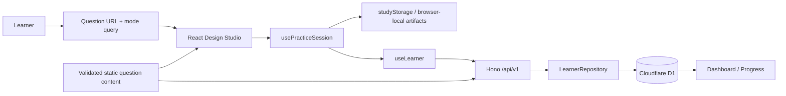
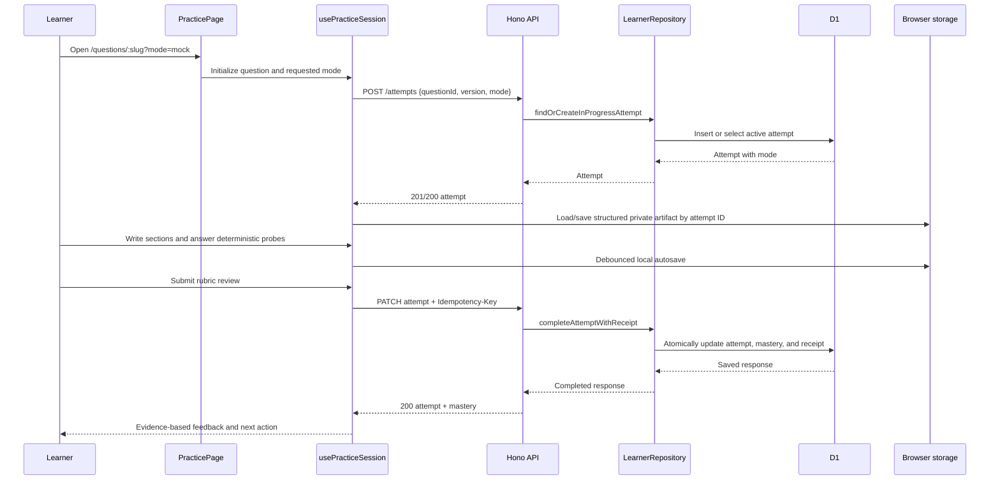

# Software Design Document

**Artifact slug:** `design-studio-practice-workflow` (paired RDD: [design-studio-practice-workflow-requirements.md](./design-studio-practice-workflow-requirements.md))  
**Workflow ID:** `ceb65545-76fa-4dc7-97a7-1f7eff67ae1e`  
**Title:** Design Studio practice workflow  
**Version:** 1.0  
**Status:** PENDING_APPROVAL

## 1. System overview

Interview Architect already has reliable static interview content, anonymous learner progress, a deterministic coach, and a timed practice page. The current practice route is intentionally simple: it starts one attempt per question, stores a single free-text draft in the browser, reveals hints and answer material, and records self-score/rubric scores. This release changes the practice experience from a self-review form into a structured **Design Studio** without changing the product's free-first, anonymous, or privacy-first foundations.

The default design treats written artifacts as learner-private browser data. The Worker/D1 API receives only session metadata needed for progress: selected mode, attempt lifecycle, scores, and idempotent completion receipts. React owns the visual studio and session-local artifact state; Hono and the repository boundary own secure attempt persistence and replay-safe completion. Existing question content supplies deterministic interviewer follow-ups, hints, answer sections, and rubrics—no paid AI or generic chat interface is introduced.

### In scope for the default implementation

- Learn and Mock modes for a question practice session.
- A structured, local-first answer workspace with session-aware draft keys.
- Deterministic interviewer probes sourced from existing `followUps` content.
- Evidence-based feedback derived from existing rubric dimensions.
- Persisted non-sensitive attempt mode and replay-safe completion metadata.
- Clear launch/resume/review actions from the dashboard and question bank.
- Complete browser-storage deletion, accessible controls, and end-to-end test coverage.

### Out of scope for the default implementation

- Server-side persistence, sync, or export of free-form workspace artifacts.
- Accounts, OAuth, peer practice, notifications, or social features.
- Paid-model integration, provider keys, or a generic AI chat interface.
- A visual architecture canvas or Mermaid rendering/editor.
- Redis, Kafka, queues, or microservices as runtime product dependencies.

### Requirements coverage

| FR/NFR ID | Design section | Notes |
|---|---|---|
| FR-1 | §3, §4, §6 | Query-backed mode picker and persisted attempt mode. |
| FR-2 | §3, §5, §6 | Structured workspace stored locally by attempt/session key. |
| FR-3 | §5, §6, §8 | Local draft schema, migration from legacy keys, resume semantics. |
| FR-4 | §3, §6, §8 | Mode-specific visibility and deterministic follow-up panel. |
| FR-5 | §3, §4, §6 | Required rubric review, feedback summary, existing progress refresh. |
| FR-6 | §3, §4, §6 | Dashboard/review and question-bank mode launch/resume actions. |
| FR-7 | §4, §5, §6, §8 | Idempotency header, receipt store, and replay behavior. |
| FR-8 | §5, §6, §8 | Centralized prefix-based browser storage erase. |
| NFR-1 | §5, §8, §9 | No free-text artifact crosses the API boundary. |
| NFR-2 | §4, §5, §6, §9 | D1 receipt transaction and retry tests. |
| NFR-3 | §3, §8, §9 | Semantic controls, keyboard flows, reduced motion, mobile E2E. |
| NFR-4 | §3, §6, §9 | Static prompt/studio shell stays usable while learner state syncs. |
| NFR-5 | §3, §7, §9 | Feature decomposition and focused test seams. |

## 1b. Scope options (user selects at SDD approval)

**Scope (choose one — default: Option 1):**

- (x) **Option 1 — Privacy-first Design Studio core** — includes Learn/Mock modes, structured local drafts, deterministic probes, feedback, attempt-mode persistence, idempotent completion, deletion fix, dashboard/question-bank entry points, and full tests. Excludes server-synced artifacts, daily-plan data models, visual diagram editing, and AI.
- ( ) **Option 2 — Studio core plus deterministic daily plan** — includes Option 1 plus learner preferences, a Today’s Plan API/model, dashboard plan card, and skill-focused review recommendations. Excludes server-synced free-text artifacts, visual diagram editing, and AI.
- ( ) **Option 3 — Studio core plus consented artifact sync** — includes Option 1 plus explicit per-session opt-in synchronization of structured artifacts, export, retention controls, and expanded deletion/cleanup coverage. Excludes AI and account/OAuth migration.

**Cleanup (optional):**

- [ ] **Remove unused files and dead code** in the affected area. The default implementation always removes superseded draft-key helpers and dead imports in touched files; this checkbox additionally authorizes broader cleanup within the practice feature.

## 2. Architecture

### Key decisions

| Decision | Choice | Rationale |
|---|---|---|
| Artifact privacy | Structured text, probe responses, reveal state, and reflection remain in browser storage. | Meets NFR-1 and preserves the product's stated privacy boundary. |
| Session identity | Reuse `practice_attempts` as the persisted session anchor; add a `mode` field instead of introducing a second session table in Option 1. | Avoids duplicate lifecycle state while supporting deterministic resume. |
| Mode routing | Use `?mode=learn` or `?mode=mock`; if a server-backed in-progress attempt exists, its persisted mode is authoritative. | Creates shareable deep links and prevents ambiguous resume behavior. |
| Draft persistence | Create a central, versioned `studyStorage` helper keyed by attempt ID, with a documented question/mode staging key before an attempt exists. | Replaces isolated `PracticePage` localStorage logic and fixes complete erasure. |
| Feedback | Compute strengths/gaps deterministically from all rubric scores, with existing static answer material shown according to mode. | Produces explainable feedback without an opaque scoring model. |
| Completion retries | Require an `Idempotency-Key` for completed-attempt writes and persist a response receipt keyed by learner and operation. | Makes lost-response retries safe and prevents duplicate mastery refresh. |
| Architecture diagrams | Do not add a visual canvas or Mermaid renderer in the default option. | Keeps the first slice focused, safe, accessible, and local-first. |



### Runtime behavior

- The route renders static question data immediately. Personal progress and attempt state hydrate in the background; the studio shell does not wait on a remote request to show the prompt.
- `PracticePage` becomes a thin route controller. Its stateful concerns move into `usePracticeSession`, focused visual components, and `studyStorage`.
- Learner free-text never appears in an API request, log, D1 row, receipt, or coach input in Option 1.
- `POST /api/v1/attempts` persists the selected `mode` when creating an attempt. Existing active attempts are returned unchanged, so the UI adopts their stored mode and provides a clear resume state.
- `PATCH /api/v1/attempts/:attemptId` records a response receipt for completed attempts and returns the saved response again for a matching retry.

## 3. Components and scope inventory

| Layer | Path / component | Change | Responsibility | FR/NFR |
|---|---|---|---|---|
| Presentation | `apps/web/src/pages/PracticePage.tsx` | Modify and simplify | Route parsing, question lookup, page-level composition, mode query normalization. | FR-1–5, NFR-5 |
| Presentation | `apps/web/src/hooks/usePracticeSession.ts` | Create | Coordinates attempt lifecycle, timer, mode, local artifact load/save, reveal state, probes, and completion feedback. | FR-1–5, NFR-1/4/5 |
| Presentation | `apps/web/src/lib/study-storage.ts` | Create | Versioned browser artifact schema, safe read/write, legacy migration, targeted clear, and global app-data clear. | FR-2/3/8, NFR-1 |
| Presentation | `apps/web/src/components/practice/SessionModePicker.tsx` | Create | Accessible Learn/Mock selection with clear consequences before start. | FR-1, NFR-3 |
| Presentation | `apps/web/src/components/practice/StructuredWorkspace.tsx` | Create | Semantically labeled design sections and autosave status. | FR-2/3, NFR-3 |
| Presentation | `apps/web/src/components/practice/InterviewerPanel.tsx` | Create | Deterministic follow-up reveal and locally stored probe responses. | FR-4 |
| Presentation | `apps/web/src/components/practice/SessionFeedback.tsx` | Create | Strengths, gaps, next action, and post-completion answer material. | FR-5 |
| Presentation | `apps/web/src/components/practice/PracticeSessionHeader.tsx` | Create | Mode state, timer, resume/abandon actions, and keyboard help. | FR-1/4, NFR-3 |
| Presentation | `apps/web/src/hooks/useLearner.tsx` | Modify | Pass mode on start, generate/reuse completion idempotency key, refresh optimistic state from replayed responses, and delegate all app storage erase. | FR-1/5/7/8 |
| Presentation | `apps/web/src/lib/api.ts` | Modify | Typed mode payload and idempotency header support. | FR-1/7 |
| Presentation | `apps/web/src/pages/DashboardPage.tsx` | Modify | Use review queue and coach result for actionable Start/Review/Resume controls. | FR-6 |
| Presentation | `apps/web/src/pages/QuestionBankPage.tsx` | Modify | Add compact Learn/Mock start choice and resume indicator without breaking URL-backed filters. | FR-6 |
| Presentation | `apps/web/src/styles/index.css` | Modify | Studio layout, mobile behavior, focus states, and `prefers-reduced-motion` treatment. | NFR-3/4 |
| Business | `packages/domain/src/index.ts` | Modify | Add `PracticeMode` and `PracticeAttempt.mode`; expose deterministic feedback helpers if they are pure and reusable. | FR-1/5 |
| HTTP | `apps/api/src/app.ts`, `apps/api/src/types.ts` | Modify | Validate mode, validate idempotency key, map replay/conflict responses, and preserve same-origin/auth checks. | FR-1/7, NFR-2 |
| Infrastructure | `apps/api/src/repository/repository.ts` | Modify | Add a receipt-aware completion method and request/response receipt contracts. | FR-7, NFR-2 |
| Infrastructure | `apps/api/src/repository/d1-repository.ts` | Modify | Persist mode, receipt records, and atomically return original completion response on replay. | FR-1/7 |
| Infrastructure | `apps/api/src/repository/memory-repository.ts` | Modify | Mirror D1 receipt/mode behavior for deterministic API tests. | FR-1/7 |
| Infrastructure | `infra/migrations/0005_design_studio_attempts.sql` | Create | Add `practice_attempts.mode`, `mutation_receipts`, and expiry index. | FR-1/7 |
| Verification | API/domain/web tests and `tests/e2e/study-flow.spec.ts` | Modify or create | Verify behavior, privacy, failure/retry, accessibility, and mobile regressions. | All |

### Removal list

- Delete the local `getDraftKey`, `readDraft`, and `writeDraft` helpers from `PracticePage` once `studyStorage` owns the behavior.
- Migrate and delete legacy runtime keys matching `interview-architect:draft:*` after successful conversion to the versioned storage schema.
- Remove no complete source file in the default option; the page is decomposed rather than replaced by a parallel route.

## 4. API design

All routes remain same-origin under `/api/v1`, retain the anonymous `ia_session` cookie, and enforce the existing trusted-origin middleware for mutations. No new authentication mechanism is introduced.

### 4.1 Start or resume an attempt

- **Method / path:** `POST /api/v1/attempts`
- **Auth:** Existing anonymous session and trusted origin.
- **Request body:**

```json
{
  "questionId": "redis-rate-limiter",
  "questionVersion": 1,
  "mode": "learn"
}
```

`mode` accepts `learn` or `mock` and defaults to `learn` for backward compatibility.

- **Success response:** `201` for a new attempt or `200` for an existing in-progress attempt. Both include `attempt.mode`.
- **Resume rule:** An in-progress attempt remains unique per learner/question. A request with a different mode does not mutate it; the response returns the original attempt/mode for the frontend to resume.
- **Errors:** Existing `401 authentication_required`, `403 untrusted_origin`, `404 question_not_found`, `409 question_version_conflict`, and `422 validation_error` for an invalid mode.
- **Idempotency:** Existing unique active-attempt constraint stays the concurrency primitive.

### 4.2 Complete an attempt safely

- **Method / path:** `PATCH /api/v1/attempts/:attemptId`
- **Auth:** Existing anonymous session and trusted origin.
- **Required request header when `status` is `completed`:** `Idempotency-Key: <client-generated UUID>`.
- **Request body:** Existing completion shape remains; free-text workspace artifacts are deliberately absent.

```json
{
  "status": "completed",
  "durationSeconds": 1320,
  "selfScore": 3,
  "rubricScores": {
    "Requirements and scope": 3,
    "Scalability and data flow": 3
  }
}
```

- **Success response:** `200` with the same existing `{ attempt, mastery? }` response shape. A matching retry returns the persisted response and an `Idempotency-Replayed: true` response header.
- **Errors:**
  - `400 idempotency_key_required` for a completed write without a valid header.
  - `409 idempotency_key_reused` when the same key is paired with a different request fingerprint.
  - Existing `404 attempt_not_found`, `409 question_unavailable`, and validation errors.
  - `409 attempt_already_finished` only when no matching receipt proves the request already succeeded.
- **Idempotency:** The server calculates a stable request fingerprint from the user ID, attempt ID, normalized body, and operation key. It atomically writes the attempt update, rubric score replacement, mastery refresh, and receipt before returning the response.

### 4.3 Dashboard review action

- **Method / path:** Existing `GET /api/v1/review-queue` and `POST /api/v1/coach/next`.
- **Change:** No response contract change in Option 1. `DashboardPage` consumes these existing routes to render an actionable first review and a mode-aware start link.
- **Auth/errors:** Existing anonymous session behavior; static catalog fallback remains available when personal APIs are unavailable.

## 5. Data model and storage policy

### 5.1 D1 changes

| Entity | Store | New / modified | Key fields | Indexes | FR |
|---|---|---|---|---|---|
| `practice_attempts` | D1 | Modified | `mode TEXT NOT NULL DEFAULT 'learn' CHECK (mode IN ('learn', 'mock'))` | Existing unique active-attempt index remains. | FR-1 |
| `mutation_receipts` | D1 | New | `user_id`, `operation_key`, `attempt_id`, `request_hash`, `response_json`, `http_status`, `created_at`, `expires_at` | Primary key `(user_id, operation_key)` and `(expires_at)` cleanup index. | FR-7 |

Migration `0005_design_studio_attempts.sql` adds the non-sensitive attempt mode with a safe default for existing rows, creates receipts, and never stores workspace text, probe answers, architecture notes, or reflection content.

The repository exposes a receipt-aware completion result that distinguishes:

1. newly completed attempt;
2. idempotent replay of the original response; and
3. a genuine conflict (different operation or already-finished attempt).

Receipt retention should match the anonymous-session retention window by default. Expired receipts are removed with the same bounded cleanup strategy used for expired learner data; this first release must not add a full-table cleanup step to every learner read.

### 5.2 Browser-local artifact schema

`studyStorage` owns every app-managed browser key with the `interview-architect:` prefix. The current raw draft key is replaced by a versioned envelope:

```ts
type PracticeArtifactV1 = {
  version: 1;
  attemptId?: string;
  questionId: string;
  questionVersion: number;
  mode: "learn" | "mock";
  updatedAt: string;
  sections: {
    clarifications: string;
    scale: string;
    architecture: string;
    apiAndDataModel: string;
    reliability: string;
    observabilityAndSecurity: string;
    tradeoffs: string;
    reflection: string;
  };
  probes: Array<{ index: number; response: string; revealedAt: string }>;
  revealed: { hints: number; answer: boolean };
};
```

- A not-yet-started draft may use a question/mode staging key; it is migrated to the attempt ID key once the API returns an attempt.
- Autosave is debounced and visibly reports local save state; browser-storage errors leave the session usable and show an unobtrusive warning.
- Completion retains the local artifact for personal review; abandon removes the active local artifact after confirmation.
- `clearInterviewArchitectStorage()` enumerates and removes every `interview-architect:` key, including legacy draft keys and learner snapshots. It is called on successful `DELETE /api/v1/me` even when `Clear-Site-Data` is unsupported.

## 6. Sequence flows

### 6.1 Start, practice, and complete a Mock session



### 6.2 Lost completion response and retry

1. The browser generates one UUID operation key before sending completion and retains it until a terminal response arrives.
2. If the connection fails after the Worker committed, the learner presses retry or the client retries with the **same** key and normalized body.
3. The repository finds the matching receipt, verifies the request hash, returns the original response, and the API sets `Idempotency-Replayed: true`.
4. The client replaces optimistic attempt state with that response; mastery is not recalculated twice.
5. If the same key is reused with a different body, return `409 idempotency_key_reused` without changing learner state.

### 6.3 Erase anonymous learner data

1. The learner confirms erase in the existing UI.
2. The client calls `DELETE /api/v1/me` with the trusted origin and current session.
3. The API deletes learner-owned D1 records, clears the session cookie, and requests `Clear-Site-Data: "storage"` for supporting browsers.
4. On successful response, the client independently calls `clearInterviewArchitectStorage()` and resets in-memory learner/session state.
5. The browser no longer has a learner snapshot, legacy free-text draft, session artifact, or pending mode state.

## 7. Risks

| ID | Risk | Impact | Mitigation | Owner phase |
|---|---|---|---|---|
| R-1 | Session state grows beyond the current `PracticePage` and becomes difficult to reason about. | High | Extract a session hook and focused presentation components before feature behavior changes; preserve a single lifecycle owner. | Frontend foundation |
| R-2 | Local private artifacts survive a claimed erase action. | High | Centralize prefix-based storage ownership and test legacy/current key removal. | Privacy/storage |
| R-3 | A completion network timeout is indistinguishable from failure. | High | Receipt-aware repository API plus repeated PATCH integration tests. | API/repository |
| R-4 | Mode selection conflicts with an existing active attempt. | Medium | Persist the first mode, return it on resume, and ask the learner to abandon before switching. | API/UX |
| R-5 | Mock mode reveals coaching content too early or merely changes colors. | Medium | Define visibility rules in components and assert them through E2E. | Frontend/QA |
| R-6 | Rich-browser storage is unavailable or corrupted. | Medium | Safe parsing, reset/corruption handling, warning state, and non-blocking practice controls. | Frontend/QA |

## 8. Edge cases and behavior

| Case | Behavior | FR/NFR |
|---|---|---|
| Invalid or absent `mode` query | Client normalizes to `learn`; API validates a supplied create body and rejects invalid values with `422`. | FR-1 |
| Existing active attempt has different mode | Use server mode for resume; show a short explanation and require abandon before a new mode starts. | FR-1, NFR-2 |
| Mock session before completion | Hide hints, reference answer, pitfalls, and score guide; allow only brief/constraints, workspace, timer, and probes. | FR-4 |
| Learn session | Allow progressive hints and guided content; preserve existing keyboard shortcut only when focus is not in a field. | FR-4, NFR-3 |
| Missing rubric score | Disable complete action and explain which dimensions remain unrated; do not calculate a partial score as final feedback. | FR-5 |
| Storage disabled/corrupt | Keep the session functional, show that drafts cannot be saved locally, and never send the draft to the API as a fallback. | FR-3, NFR-1 |
| Lost completion response | Retry with same operation key and return original response. | FR-7, NFR-2 |
| Same idempotency key, changed completion body | Return `409 idempotency_key_reused`; preserve existing attempt/mastery. | FR-7 |
| Browser does not honor `Clear-Site-Data` | Client clears the app prefix after delete success. | FR-8 |
| Narrow viewport/reduced motion | Stack studio panels, preserve timer/action visibility, avoid mandatory animation, and keep controls keyboard reachable. | NFR-3 |

## 9. Testing strategy and verification checklist

| Layer | Approach | Tools | FR/NFR coverage |
|---|---|---|---|
| Domain | Test `PracticeMode` compatibility and deterministic rubric-feedback categorization if added to the domain package. | Vitest | FR-1, FR-5 |
| Browser storage | Unit-test serialization, legacy migration, corruption handling, prefix erase, and no accidental API artifact payload. | Vitest in web workspace or focused pure helper tests | FR-2, FR-3, FR-8, NFR-1 |
| API | Test mode validation/default, receipt creation, identical completion replay, changed-body key conflict, ownership/auth/origin failures, and cleanup behavior. | Vitest + existing Hono/D1/memory tests | FR-1, FR-7, NFR-2 |
| Repository | Test D1 and memory parity for mode persistence and completion receipts; ensure rubric/mastery are not duplicated. | Vitest | FR-7, NFR-2 |
| UI/E2E | Learn session structured autosave/reload, Mock information hiding, follow-up responses, required rubric review, feedback, resume link, erase cleanup, and responsive/keyboard behavior. | Playwright | FR-1–6, FR-8, NFR-1/3/4 |
| Regression | Run existing content, type, package/API, build, and E2E suites. | `npm run content:validate`, `npm run typecheck`, `npm test`, `npm run build`, `npm run test:e2e` | All |

### Acceptance checklist

- [ ] A learner can deep-link to `?mode=learn` and `?mode=mock`, and an active attempt resumes the server-persisted mode.
- [ ] The workspace contains all eight structured sections and autosaves only in browser-managed storage.
- [ ] Learn and Mock present materially different guidance/answer visibility, not only different styling.
- [ ] Existing follow-up content can be answered as deterministic probes and survives reload locally.
- [ ] A completed session produces strengths, gaps, and a concrete next action from the rubric.
- [ ] An identical completion retry returns success without duplicate attempt/mastery mutation; a mismatched retry conflicts safely.
- [ ] Dashboard/review/question bank can launch the intended session or resume active work.
- [ ] Erase removes `interview-architect:learner:v1`, legacy `interview-architect:draft:*`, and all new studio keys in an explicit client fallback.
- [ ] Desktop and mobile Playwright paths, API tests, typecheck, build, content validation, and full suite pass.

## 10. Appendix

### Option 2 delta: deterministic daily plan

Option 2 additionally adds `learner_preferences`, `study_plans`, and `study_plan_items`; preference endpoints; an idempotent plan-generation endpoint; and a dashboard card containing due review, fresh question, time budget, and rationale. It still does not store free-text artifacts.

### Option 3 delta: consented artifact synchronization

Option 3 requires a separate explicit consent control, `practice_session_artifacts` storage, retention policy, user export, deletion/expiry updates, request-size limits, and tests proving free-text is never synced without consent. It is not a silent extension of Option 1.

### Open decisions resolved for Option 1

- **Artifact retention:** retain only locally until the learner abandons, erases all data, or browser storage is cleared.
- **Daily plan:** defer full planner data model; provide clearer existing dashboard/review launch actions.
- **Diagram tooling:** defer; initial structure is readable text sections and avoids unsafe markup rendering.

### Reference files

- `apps/web/src/pages/PracticePage.tsx`
- `apps/web/src/hooks/useLearner.tsx`
- `apps/web/src/pages/DashboardPage.tsx`
- `apps/web/src/pages/QuestionBankPage.tsx`
- `apps/web/src/lib/api.ts`
- `apps/api/src/app.ts`
- `apps/api/src/repository/repository.ts`
- `apps/api/src/repository/d1-repository.ts`
- `apps/api/src/repository/memory-repository.ts`
- `packages/domain/src/index.ts`
- `infra/migrations/0001_initial.sql` through `0004_idempotent_in_progress_attempts.sql`
- `tests/e2e/study-flow.spec.ts`

### Related Jira

_(Jira is disabled for this repository; the workflow will produce a local manifest rather than an external Epic.)_
